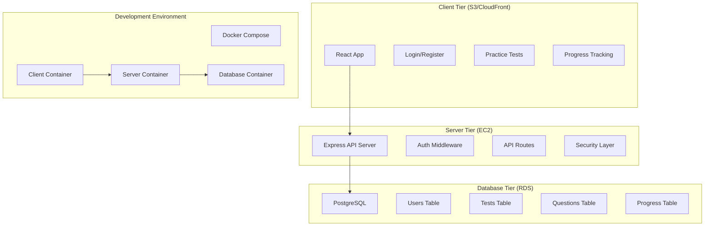

# Design Document

## Overview

This design transforms the existing single-tier AWS practice test React application into a secure 3-tier architecture consisting of:

1. **Client Tier**: React frontend served from static hosting (S3/CloudFront)
2. **Server Tier**: Node.js/Express REST API with JWT authentication (EC2)
3. **Database Tier**: PostgreSQL with migrated test data and user management (RDS)

The architecture maintains all existing functionality while adding user authentication, progress tracking, and cloud-ready deployment structure. Security is prioritized through parameterized queries, input sanitization, and JWT-based stateless authentication.

## Architecture



## Components and Interfaces

### Client Components

**Authentication Components**:
- `LoginForm`: User login with email/password
- `RegisterForm`: User registration with validation
- `AuthProvider`: React context for authentication state
- `ProtectedRoute`: Route wrapper requiring authentication

**Enhanced Existing Components**:
- `App`: Modified to include authentication flow
- `RandomPractice`: Maintains existing behavior (no progress saving)
- `MockTest`: Enhanced with session persistence and result history
- `PracticeMode`: Maintains existing behavior (no progress saving)
- `StudyMode`: New component with saved progress and user-specific tracking

**API Service Layer**:
- `authService`: Login, register, token management
- `testService`: Fetch tests and questions from API
- `progressService`: Save and retrieve user progress (Study Mode and Mock Test results only)

### Server Components

**Authentication Layer**:
- `authController`: Handle login/register requests
- `authMiddleware`: JWT token validation
- `passwordService`: bcrypt hashing utilities

**API Controllers**:
- `testController`: Serve test metadata and questions
- `progressController`: Handle user progress operations
- `userController`: User profile management

**Security Layer**:
- `inputValidator`: Sanitize and validate inputs
- `rateLimiter`: Prevent API abuse
- `corsConfig`: Configure cross-origin requests

**Database Layer**:
- `dbConnection`: PostgreSQL connection pool
- `userModel`: User CRUD operations
- `testModel`: Test and question queries
- `progressModel`: Progress tracking operations

### Database Schema

**Users Table**:
```sql
CREATE TABLE users (
    id SERIAL PRIMARY KEY,
    email VARCHAR(255) UNIQUE NOT NULL,
    password_hash VARCHAR(255) NOT NULL,
    first_name VARCHAR(100),
    last_name VARCHAR(100),
    created_at TIMESTAMP DEFAULT CURRENT_TIMESTAMP,
    updated_at TIMESTAMP DEFAULT CURRENT_TIMESTAMP
);
```

**Tests Table**:
```sql
CREATE TABLE tests (
    id VARCHAR(50) PRIMARY KEY,
    name VARCHAR(255) NOT NULL,
    description TEXT,
    category VARCHAR(100),
    difficulty VARCHAR(50),
    total_questions INTEGER,
    time_limit INTEGER,
    passing_score INTEGER,
    created_at TIMESTAMP DEFAULT CURRENT_TIMESTAMP
);
```

**Questions Table**:
```sql
CREATE TABLE questions (
    id VARCHAR(50) PRIMARY KEY,
    test_id VARCHAR(50) REFERENCES tests(id),
    question_number INTEGER,
    question_text TEXT NOT NULL,
    choices JSONB NOT NULL,
    correct_answer VARCHAR(10) NOT NULL,
    is_multiple_choice BOOLEAN DEFAULT FALSE,
    question_images TEXT[],
    answer_images TEXT[],
    discussion JSONB,
    discussion_count INTEGER DEFAULT 0
);
```

**User Progress Table** (for Study Mode):
```sql
CREATE TABLE user_progress (
    id SERIAL PRIMARY KEY,
    user_id INTEGER REFERENCES users(id),
    test_id VARCHAR(50) REFERENCES tests(id),
    question_id VARCHAR(50) REFERENCES questions(id),
    user_answer VARCHAR(10),
    is_correct BOOLEAN,
    time_taken INTEGER,
    session_type VARCHAR(20) CHECK (session_type IN ('study')),
    created_at TIMESTAMP DEFAULT CURRENT_TIMESTAMP
);
```

**Mock Test Results Table**:
```sql
CREATE TABLE mock_test_results (
    id SERIAL PRIMARY KEY,
    user_id INTEGER REFERENCES users(id),
    test_id VARCHAR(50) REFERENCES tests(id),
    score INTEGER NOT NULL,
    total_questions INTEGER NOT NULL,
    time_spent INTEGER NOT NULL,
    completed_at TIMESTAMP DEFAULT CURRENT_TIMESTAMP
);
```

**Mock Test Answers Table**:
```sql
CREATE TABLE mock_test_answers (
    id SERIAL PRIMARY KEY,
    mock_test_result_id INTEGER REFERENCES mock_test_results(id),
    question_id VARCHAR(50) REFERENCES questions(id),
    user_answer VARCHAR(10),
    is_correct BOOLEAN,
    time_taken INTEGER
);
```

## Data Models

### TypeScript Interfaces

**User Model**:
```typescript
interface User {
  id: number;
  email: string;
  firstName?: string;
  lastName?: string;
  createdAt: Date;
  updatedAt: Date;
}

interface AuthResponse {
  user: User;
  token: string;
  expiresIn: number;
}
```

**Enhanced Question Model**:
```typescript
interface Question {
  question_id: string;
  test_id: string;
  question_number: number;
  question_text: string;
  choices: Record<string, string>;
  correct_answer: string;
  is_multiple_choice: boolean;
  question_images?: string[];
  answer_images?: string[];
  discussion?: Discussion[];
  discussion_count?: number;
}
```

**Progress Model**:
```typescript
interface UserProgress {
  id: number;
  userId: number;
  testId: string;
  questionId: string;
  userAnswer: string;
  isCorrect: boolean;
  timeTaken: number;
  sessionType: 'mock' | 'study'; // Only mock and study modes save progress
  createdAt: Date;
}

interface MockTestResult {
  id: number;
  userId: number;
  testId: string;
  score: number;
  totalQuestions: number;
  timeSpent: number;
  completedAt: Date;
  questions: UserProgress[];
}

interface StudyProgress {
  userId: number;
  testId: string;
  questionsStudied: string[];
  lastStudiedAt: Date;
  totalTimeSpent: number;
}

interface ProgressStats {
  totalMockTests: number;
  averageMockScore: number;
  studyProgress: Record<string, {
    questionsStudied: number;
    totalQuestions: number;
    timeSpent: number;
  }>;
  mockTestHistory: MockTestResult[];
}
```

## Correctness Properties

*A property is a characteristic or behavior that should hold true across all valid executions of a system-essentially, a formal statement about what the system should do. Properties serve as the bridge between human-readable specifications and machine-verifiable correctness guarantees.*

### Property Reflection

After analyzing all acceptance criteria, I identified several areas where properties can be consolidated:
- Authentication properties (1.1, 1.2, 1.3) can be combined into comprehensive authentication behavior
- Security properties (1.4, 1.5, 7.2, 7.3) overlap and can be consolidated
- Data persistence properties (2.1, 2.2, 2.3) can be combined into general data storage behavior
- Token validation properties (3.4, 7.4, 7.7) can be unified into JWT token management

### Authentication Properties

**Property 1: User Registration Security**
*For any* valid user registration data, the system should create a user account with a bcrypt-hashed password that cannot be reversed to the original password
**Validates: Requirements 1.1, 7.1**

**Property 2: Login Token Generation**
*For any* valid user credentials, the authentication system should return a properly formatted JWT token with appropriate expiration
**Validates: Requirements 1.2**

**Property 3: Invalid Credential Rejection**
*For any* invalid login credentials, the authentication system should reject the attempt and return an appropriate error message without revealing whether the email exists
**Validates: Requirements 1.3**

### Security Properties

**Property 4: SQL Injection Prevention**
*For any* user input containing malicious SQL code, the system should prevent database manipulation through parameterized queries
**Validates: Requirements 1.4, 7.3**

**Property 5: XSS Attack Prevention**
*For any* user input containing malicious scripts, the system should sanitize the input and prevent script execution
**Validates: Requirements 1.5, 7.2**

**Property 6: Authorization Enforcement**
*For any* request to protected endpoints without a valid JWT token, the server should return an unauthorized error
**Validates: Requirements 1.6, 3.4**

### Data Persistence Properties

**Property 7: Secure Data Storage**
*For any* user data stored in the database, passwords should be hashed and all data should be properly persisted and retrievable
**Validates: Requirements 2.1, 2.2, 2.3**

**Property 8: Referential Integrity**
*For any* database operation attempting to create invalid foreign key relationships, the database should reject the operation
**Validates: Requirements 2.6**

### API Behavior Properties

**Property 9: Error Response Consistency**
*For any* error condition in the API, the server should return appropriate HTTP status codes and consistent error message format
**Validates: Requirements 3.5**

**Property 10: CORS Configuration**
*For any* cross-origin request, the server should allow requests from valid frontend domains and reject requests from unauthorized origins
**Validates: Requirements 3.6**

**Property 11: Rate Limiting**
*For any* client making excessive requests, the server should throttle requests after exceeding the configured rate limit
**Validates: Requirements 3.7**

### Client Behavior Properties

**Property 12: API-Only Data Loading**
*For any* test data request, the client should make API calls to the backend and never load data from local JSON files
**Validates: Requirements 4.3**

**Property 13: Authentication Redirect**
*For any* unauthenticated user attempting to access protected pages, the client should redirect to the login page
**Validates: Requirements 4.4**

**Property 14: API Error Handling**
*For any* API error response, the client should handle the error gracefully and display user-friendly error messages
**Validates: Requirements 4.5**

### Migration Properties

**Property 15: Data Migration Integrity**
*For any* question migrated from JSON files to the database, all relationships and metadata should be preserved exactly
**Validates: Requirements 6.3**

### Token Management Properties

**Property 16: JWT Token Lifecycle**
*For any* JWT token, the system should enforce expiration times and provide secure refresh mechanisms
**Validates: Requirements 7.4, 7.7**

**Property 17: Input Validation**
*For any* API endpoint receiving user input, the server should validate the input format and reject invalid data
**Validates: Requirements 7.6**

### Progress Tracking Properties

**Property 18: Study Mode Progress Persistence**
*For any* completed question in Study Mode, the server should save the user's progress to the database immediately
**Validates: Requirements 8.1**

**Property 19: Mock Test Results Storage**
*For any* completed Mock Test, the server should save the full test results and individual answers to the database
**Validates: Requirements 8.2**

**Property 20: Session Restoration**
*For any* returning authenticated user, the client should restore their Study Mode progress and Mock Test history from the server
**Validates: Requirements 8.3**

**Property 21: Statistics Accuracy**
*For any* user activity in Study Mode or Mock Tests, the database should accurately track and calculate statistics
**Validates: Requirements 8.4**

**Property 22: Cross-Device Continuity**
*For any* user accessing the application from different devices, their Study Mode and Mock Test progress should be consistent and accessible
**Validates: Requirements 8.6**

**Property 23: Mode-Specific Progress Handling**
*For any* user activity in Random Practice or Practice Mode, the system should not save progress to maintain existing behavior
**Validates: Requirements 8.7**

## Error Handling

### Client-Side Error Handling
- **Network Errors**: Display user-friendly messages for connection issues
- **Authentication Errors**: Redirect to login and clear invalid tokens
- **Validation Errors**: Show field-specific error messages
- **API Errors**: Parse error responses and display appropriate messages

### Server-Side Error Handling
- **Authentication Failures**: Return 401 with clear error messages
- **Authorization Failures**: Return 403 for insufficient permissions
- **Validation Errors**: Return 400 with detailed validation messages
- **Database Errors**: Return 500 with generic error (log specific details)
- **Rate Limiting**: Return 429 with retry-after headers

### Database Error Handling
- **Connection Failures**: Implement connection retry logic
- **Constraint Violations**: Return appropriate error codes
- **Migration Failures**: Provide rollback mechanisms
- **Data Integrity Issues**: Log errors and maintain consistency

## Testing Strategy

### Dual Testing Approach
The system will use both unit tests and property-based tests for comprehensive coverage:

**Unit Tests**: Verify specific examples, edge cases, and error conditions
- Authentication flow examples (valid/invalid credentials)
- API endpoint responses for specific inputs
- Database migration with sample data
- Container startup and networking

**Property Tests**: Verify universal properties across all inputs
- Password hashing for any valid password
- JWT token validation for any token format
- SQL injection prevention for any malicious input
- Data persistence for any valid data

### Property-Based Testing Configuration
- **Testing Library**: fast-check for JavaScript/TypeScript property-based testing
- **Test Iterations**: Minimum 100 iterations per property test
- **Test Tagging**: Each property test tagged with format: **Feature: three-tier-architecture-migration, Property {number}: {property_text}**

### Testing Coverage
- **Authentication**: Login/register flows, token validation, security
- **API Endpoints**: All CRUD operations, error handling, rate limiting
- **Database**: Data persistence, migration integrity, referential integrity
- **Client Integration**: API communication, error handling, authentication flows
- **Security**: SQL injection, XSS prevention, input validation
- **Development Environment**: Docker container orchestration, networking

### Integration Testing
- **End-to-End Flows**: Complete user journeys from registration to test completion
- **Cross-Service Communication**: Client-server-database interaction
- **Security Testing**: Penetration testing for common vulnerabilities
- **Performance Testing**: Load testing for concurrent users and large datasets

<function_calls>
<invoke name="prework">
<parameter name="featureName">three-tier-architecture-migration